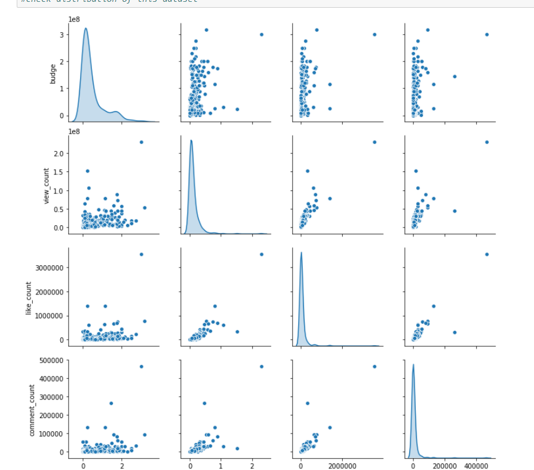
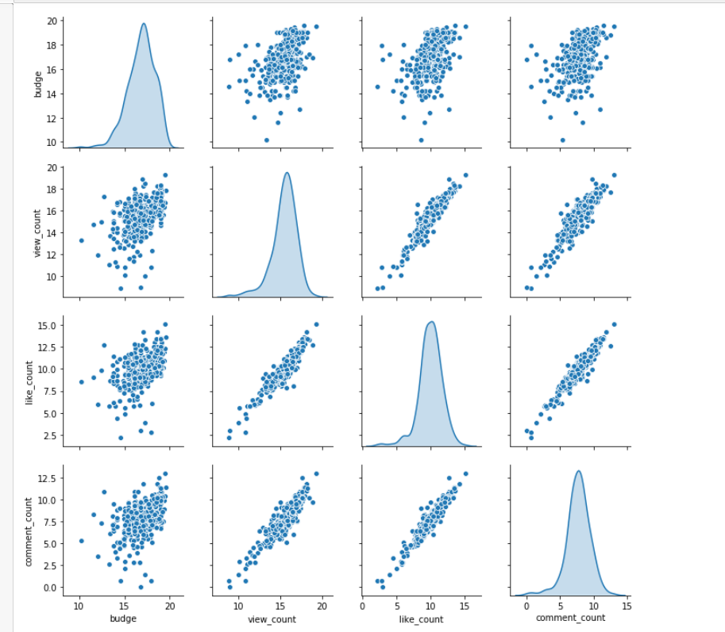

#HOT FIX 

###Run classification / classifcation log transform jupyter notebook from data folder(not data1)

## FIXED DOMESTIC GROSS TO WORLDWIDE GROSS FROM DATA CLEANING

## ADDED CLASSIFICATION LOG TRANSFORMATION 

#Original Data distribution:

#Log Transformed Data Distribution

#Test Data Accuracy improve from 65% to 83%
 
